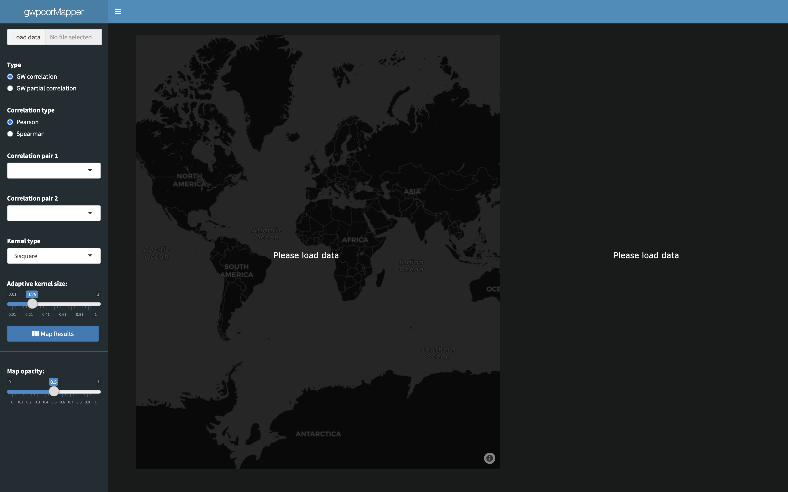
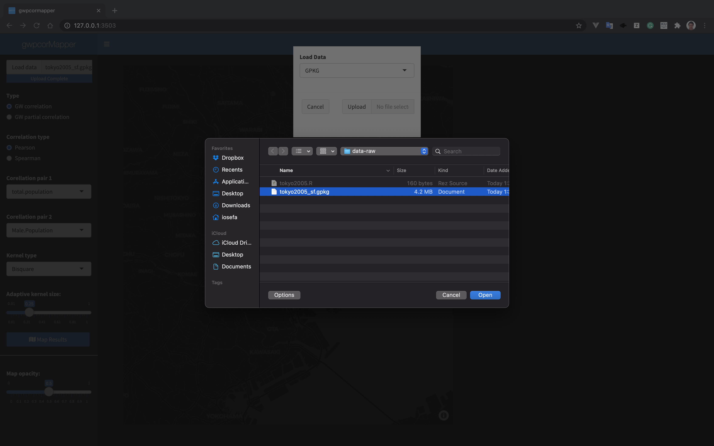
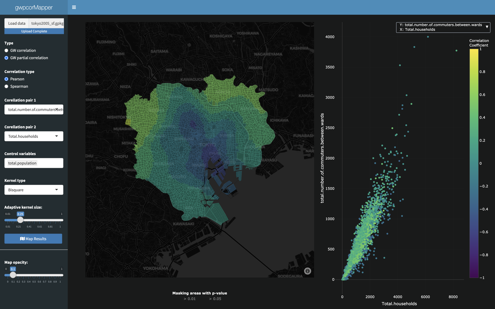
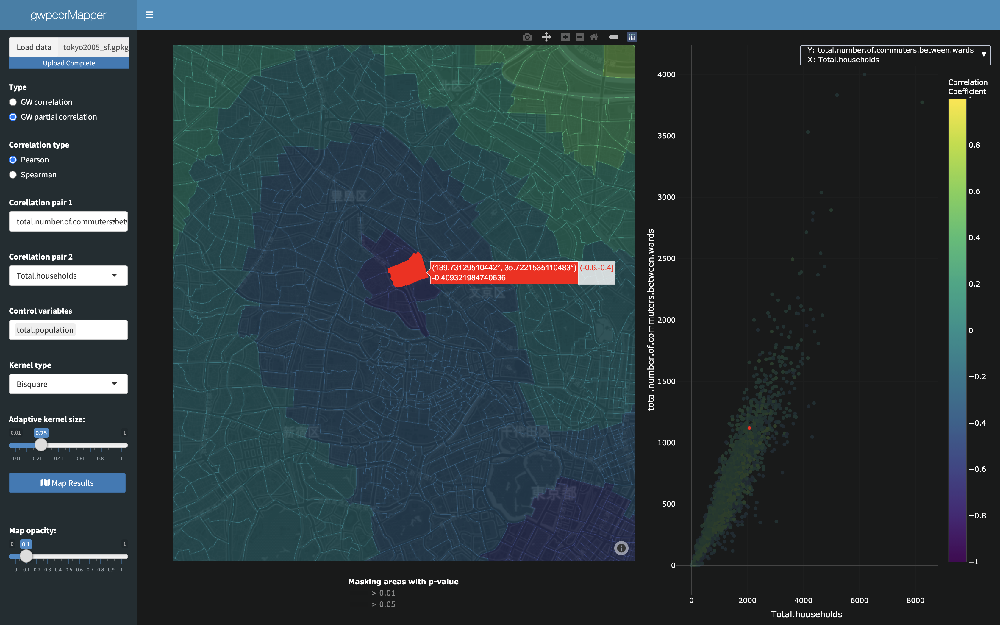
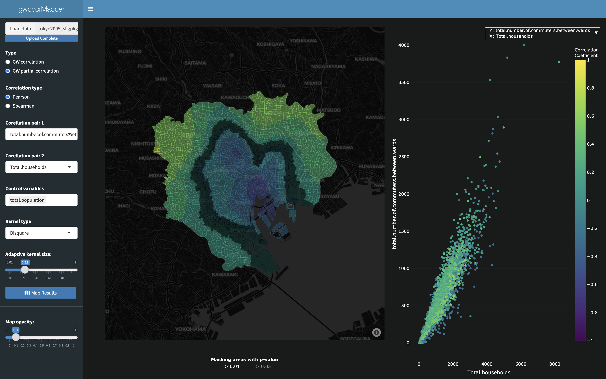
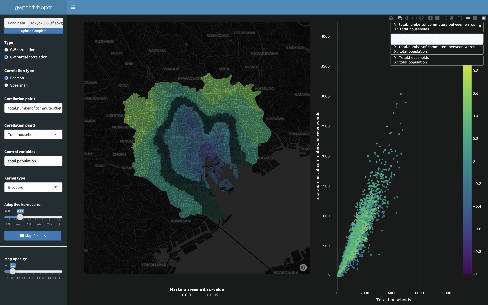

# Welcome

Welcome to the gwpcorMapper application! gwpcorMapper is an R Shiny application for mapping
 Geographically Weighted (GW) correlation and partial correlation coefficients to be used for Exploratory Spatial Data Analysis (ESDA). This documentation will help you get started in
 installing and launching the application.

## Prerequisite

This documentation will use the Tokyo 2005 Census data that is included in this package. To use this data, you will need to export it to any one of the accepted geospatial formats (see below) using the following code:

```R
library(sf)

data(tokyo2005, package = "gwpcormapper")
st_write(tokyo2005, "tokyo2005.gpkg")
```

This will load the package data and then use the `sf` library to write this to a `geopackage` that we will then later import and analyze with gwpcorMapper.

# Installation

gwpcorMapper is currently hosted on GitHub and can be installed using the `remotes` R package. If
 `remotes` is not installed, please first install `remotes` by:

```R
install.packages("remotes")
```

Then, with `remotes`, you can install gwpcorMapper from GitHub using:

```R
remotes::install_github("naru-T/gwpcormapper")
```

# Usage

## Launching the app:

To launch gwpcorMapper, simply run the following command in an R terminal:

```R
gwpcormapper::run_app()
```

Assuming all the default settings, this will open a web browser with gwpcorMapper looking like the following:

{ width=100% }

The user interface is broken down into 3 basic parts: (1) data import and parameter controls in the collapsible left side menu. (2) the map panel, which will plot the GW (partial) correlation coefficients. (3) the scatter plot panel, which will plot the global scatter plot of the bi-variate pair under analysis.

## Loading data:

gwpcorMapper can read data from the current formats:

* csv
* geojson
* geopackage
* ESRI shapefile

To load data, simply click the `Load data` button, select a file type, then click `Upload` to select a file and load it into the application.

{ width=100% }

Once the data is loaded, the map will center and zoom to the extent of the region contained by the data, however no results will be visible until `Map Results` is clicked.

## Mapping GW Correlation and GW Partial Correlation

### Parameter Selection

Select `Type` as one of `GW correlation` or `GW partial correlation` and `Correlation type` as one of `Pearson` or `Spearman` for parametric or non-parametric correlation methods respectively.

Search and select bi-variate pairs by declaring `Correlation pair 1` and `Correlation pair 2`. In the case of `GW partial correlation`, a third field for `Control variables` becomes visible. It is possible to search and select any number of control variables.

Select `Kernel type` from any one of the following supported kernel types: `Gaussian`, `Exponential`, `Bisquare`, `Tricube`, or `Box-car`; and the adaptive bandwidth size by setting the bandwidth slider to the desired fraction of the data (i.e. a bandwidth of 0.1 will represent 10% of the data - that is 10% of the nearest neighbors under the weighted moving window).

### Map Results

Clicking `Map Results` will result in the generation of both the geographically weighted correlation surface map and the scatter plot of the bi-variate pairs under scrutiny.

{ width=100% }

#### Map opacity

The opacity of the GW (partial) correlation map layer can be controlled using the `Map opacity` slider.

#### Map and Scatter Interaction

Click map or scatter plot features will interactively highlight both points on the map as well as in the scatter plot.

{ width=100% }

#### Statistical Significance Masking

Mask values with p-values of t test that are greater than 0.01 or 0.05 by clicking on the threshold to `Mask areas with p-value`. For example, selecting 0.01:

{ width=100% }

#### Scatter Plot Variable Selection

Each pair of bi-variate pairs from the selected data that was analyzed can be plotted in the scatter plot. Simply select the the pair from the drop-down list:

{ width=100% }

## Declaring Base Maps

To change the default base map, you must create an `.Renviron` file for the R Shiny app to read from. Simply create a file, name it `.Renviron`, and place it into the current working directory. Map base maps can be declared by either providing a Mapbox token and Mapbox style, or by providing a URL for a tile service.

### Mapbox Styles

To use a [mapbox style](https://docs.mapbox.com/api/maps/styles/), define your mapbox token in your `.Renviron` like the following:

```dotenv
MAPBOX_TOKEN=<replace with your mapbox token>
```

Then, declare the desired style:

```dotenv
STYLE=<replace with mapbox style>
```

Mapbox styles may be any one of the following:

_Mapbox token required:_
* basic
* streets
* outdoors
* light
* dark
* satellite
* satellite-streets

_Mapbox token not required:_
* open-street-map
* carto-positron
* carto-darkmatter
* stamen-terrain
* stamen-toner
* stamen-watercolor

For example, using gwpcorMapper with a `satellite` base map will require an `.Renviron` that may look like the following:

```dotenv
MAPBOX_TOKEN=<replace with token>
STYLE=satellite
```

{ width=100% }

More details can be found in [Mapbox documentation](https://docs.mapbox.com/api/maps/styles/)

### Custom Tiles

Alternatively, it is also possible to load a custom map tile source. These must be [TileJSON](https://github.com/mapbox/tilejson-spec) compliant. Custom tile sources are declared by defining the `SOURCE` environmental variable. In `.Renviron`, such may look like:

```dotenv
SOURCE=https://cyberjapandata.gsi.go.jp/xyz/std/{z}/{x}/{y}.png
```

This uses the Japan Standard Base Map created by the [Japanese Geospatial Information Authority of Japan](https://maps.gsi.go.jp/development/ichiran.html):

{ width=100% }

**Note:** If both `SOURCE` and `STYLE` are defined, then the application will default to `SOURCE`.
